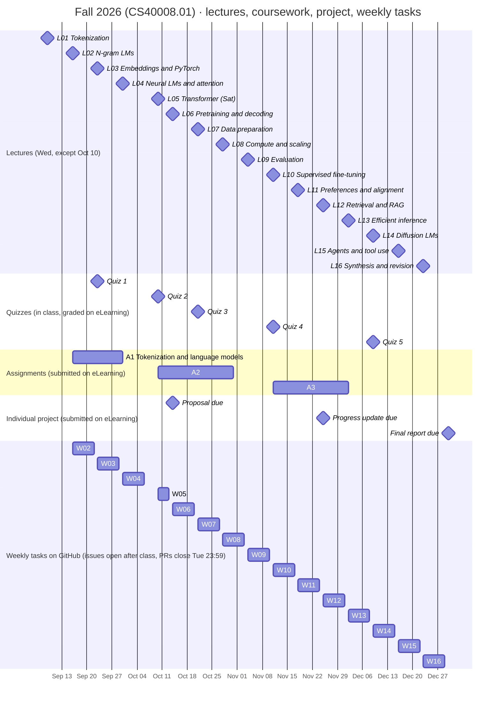
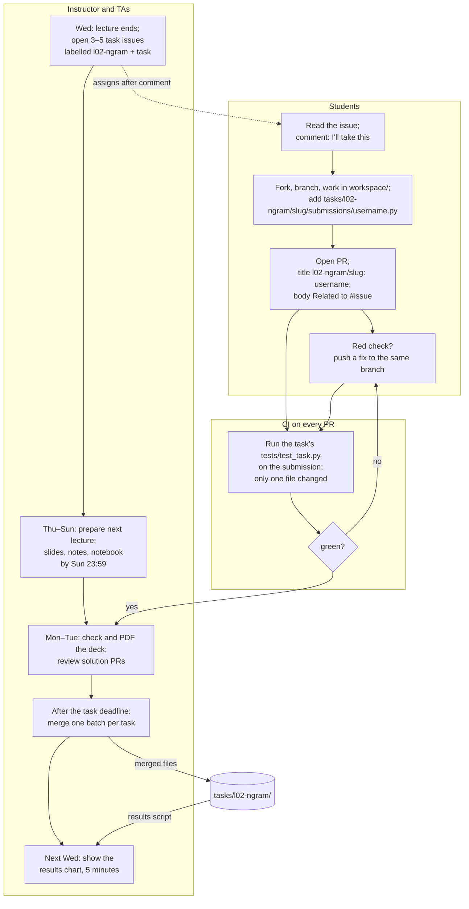

# Participation workflow: timelines, issues, and pull requests

This page describes the course's GitHub assignment announcements and
participation (weekly tasks and surveys): when the teaching team opens
issues, when students submit, who checks what, and how the results return
to the class. Graded work (quizzes, assignments, the individual project) is
submitted on [Fudan eLearning](https://elearning.fudan.edu.cn/), not here; section 0 draws the line. The diagrams are
[Mermaid](https://mermaid.js.org/) and render on GitHub; edit the text to
change them. Dates come from [schedule.md](schedule.md) and the
[course website](../index.html); change them there first, then here.

Related: the [closed Week 1 survey archive](../tasks/l01-tokenization/llm-app-survey/README.md)
records the first-PR activity and its results. Collection closed on September 20,
2026, at 23:59 (Asia/Shanghai); new responses are not accepted. Accepted responses
retain one survey participation entry, separate from coding-task correctness,
and require no resubmission. Exercise solutions
follow the deadline and batch rule below; public PRs are visible before merging.

## 0. Where each piece of work is submitted

Two channels, and they do not mix:

| Work | Counts toward | Where to submit | Submission public? |
| --- | --- | --- | --- |
| Quizzes 1–5 | Quizzes 10% | In class; grades recorded on [Fudan eLearning](https://elearning.fudan.edu.cn/) | no |
| Assignments A1–A3 | Assignments 45% | [Fudan eLearning](https://elearning.fudan.edu.cn/), as announced there | no |
| Individual project (proposal, progress update, final report) | Project 45% | [Fudan eLearning](https://elearning.fudan.edu.cn/), as announced there | no |
| Weekly tasks and surveys (this page) | Participation record on the [progress board](../tasks/PROGRESS.md); how it counts toward the grade is announced on the course website | Pull request to this repository | yes |
| Proposals and problem reports about course material | Credited in the task or file you improved | GitHub issue form, then a pull request | yes |

Nothing graded is submitted through GitHub, and nothing on GitHub needs a
real name or student ID. If an assignment asks you to reuse code from a
weekly task, copy it into your [eLearning](https://elearning.fudan.edu.cn/) submission; do not link the PR.

### Assignment announcements

The teaching team opens one public issue per released assignment with the
`assignment` label. Students can find all of them in the
[assignment announcement list](https://github.com/baojian/llm-26-fall/issues?q=is%3Aissue%20label%3Aassignment)
and subscribe to the relevant issue for updates. [A1's announcement](https://github.com/baojian/llm-26-fall/issues/140)
is the first example.

- Title: `A1: <assignment title> — due <date>, <time> (Asia/Shanghai)`.
- Body: release date, full deadline with year and time zone, course weight,
  links to the published handout and submission instructions, eLearning,
  and the handout's late policy. Use the same requirements for every student.
- Comments: announcements and general clarifications. Solutions, completed
  reports, results, student IDs, and grades stay private on eLearning.
- Updates: keep the title and body synchronized with the handout and
  eLearning; post a dated comment explaining any deadline or requirement change.
- Lifecycle: keep the issue open during the submission and clarification
  period; the teaching team closes it when that period ends. Students do not
  claim this issue, submit a PR to it, or close it when they finish.

## 1. Semester timeline

Week 5's window is short because the make-up class is on Saturday, Oct 10
and the next lecture is Wednesday, Oct 14.

## 2. One week, three roles

Every teaching week runs the same loop. The instructor's lecture preparation
for the *next* week overlaps with the students' task window for *this* week.

Default deadlines inside one week (a task's published deadline takes precedence):

| Day | Instructor and TAs | Students |
| --- | --- | --- |
| Wed (lecture) | Open the lecture's task issues (labels `lNN-topic` + `task`); announce the deadline | Pick a task; comment to claim |
| Thu–Sun | Prepare next week's lecture: slides, notes, notebook by **Sun 23:59** (a tracking issue like #39 per lecture) | Work on the task; open the PR early so CI can run |
| Mon–Tue | Run `npm --prefix slides run check` and `pdf` on the new deck; review task PRs without merging | Fix red checks; final push by **Tue 23:59** |
| After the task deadline | Finish reviews, then merge one batch per task | Wait for the batch; a timely PR need not be merged by the deadline |
| Wed (next lecture) | Regenerate the chart from `tasks/lNN-topic/`; show it | See the class result |

## 3. Life of a task issue

```mermaid
stateDiagram-v2
    [*] --> Open: team opens issue with labels lNN-topic and task
    Open --> Claimed: student comments, team assigns (max 2 per student per week)
    Claimed --> InReview: PR opened with Related to #N
    InReview --> Red: CI check fails
    Red --> InReview: fix pushed to the same branch
    InReview --> Ready: checks pass and team approves
    Ready --> Merged: deadline passed; included in the task's single batch
    Merged --> Counted: results script runs after Tue 23:59
    Counted --> [*]
    Open --> Expired: unclaimed by Tue 23:59
    Claimed --> Expired: no PR by Tue 23:59
    Expired --> [*]: closed with label not-done
```

**Mandatory merge policy (September 20, 2026):** exercise solutions and
corrections merge only after the published deadline, in one batch per task.
Review and run checks before then, but do not merge or enable auto-merge.
Verify the current time against the matching deadline and time zone in
`task.toml`, `instruction.md`, and the release issue; unclear deadlines block
merging. Finish reviewing all on-time PRs, record the batch and reviewed
commits in the task's `merge-batch.md`, and check for an existing batch before
merging. See the [teaching-team checklist](../tasks/README.md#teaching-team-merge-solutions-once-after-the-deadline).

Late submissions, later solution fixes, and exceptions need an explicit
instructor decision naming the task and exception. A general request to merge
student PRs does not waive the rule. Survey responses and course-material
fixes without student exercise solutions follow their own policies.

Public PRs and forks remain visible before merge. Delaying a merge keeps
solutions off `main` during the exercise, but does not make them private.
Use eLearning or an instructor-approved private channel when privacy is needed.

A student PR never closes a shared issue: PR bodies say `Related to #N`, not
`Fixes #N`, so several students can submit to the same issue.

## 4. Labels and naming rules (do not vary them)

Every lecture activity issue carries **one lecture label and one type label**.
Lecture labels follow the numbered sequence in [schedule.md](schedule.md),
and zero-padding keeps them sorted. Lecture 05 is the Transformer meeting on
October 10; Lecture 16 is research synthesis and project revision. The
[September 29 proposal](schedule-adjustment-proposal.md) records the migration
from the earlier labels. Keep published task folders and submission paths stable.

Assignment announcement issues use the `assignment` type label and the
assignment ID in their title. Lecture labels are optional for these issues
because an assignment can cover several lectures.

| Lecture labels (blue) | Type labels |
| --- | --- |
| `l01-tokenization`, `l02-ngram`, `l03-embeddings`, `l04-attention`, `l05-transformer`, `l06-pretraining`, `l07-data`, `l08-scaling`, `l09-evaluation`, `l10-sft`, `l11-alignment`, `l12-rag`, `l13-inference`, `l14-diffusion`, `l15-agents`, `l16-synthesis` | `task` (student exercise, many submissions), `assignment` (graded assignment announcements and deadlines; submissions go through eLearning), `proposal` (a task suggested by a student through the issue form; relabelled `task` when accepted), `help wanted` (one student, improves the repo), `bug`, `figure`, `survey`, `prep` (teaching team's own lecture preparation, e.g. #39), `project` (teaching-team tracking only; project deliverables go through [eLearning](https://elearning.fudan.edu.cn/)), `not-done` |

For weekly tasks, use the following naming and submission rules:

| Item | Rule | Example |
| --- | --- | --- |
| Issue title | `<lecture label>: <short title>` | `l02-ngram: bigram perplexity on your own text` |
| Issue labels | one lecture label + one type label | `l02-ngram`, `task` |
| Issue body | Link to the task folder; the folder's `instruction.md` holds goal, interface, examples, checker, deadline | `tasks/l02-ngram/bigram-perplexity/` |
| Student file | `tasks/<lecture label>/<slug>/submissions/<username>.py`, username in lowercase (see [tasks/README.md](../tasks/README.md)) | `tasks/l02-ngram/bigram-perplexity/submissions/octocat.py` |
| PR title | `<lecture label>/<slug>: <username>` | `l02-ngram/bigram-perplexity: octocat` |
| PR body | `Related to #<issue>` | `Related to #45` |
| Branch in the fork | `<lecture label>-<slug>` | `l02-ngram-bigram-perplexity` |
| Deadline | Tuesday 23:59 (Asia/Shanghai) of the same week | — |

Students can propose tasks and report problems through the issue forms
(**New issue** → *Propose a task* or *Report a problem in course material*).
An accepted proposal is credited in the task's `instruction.md`.

Privacy: GitHub username only, no real names or student IDs; the same rule as
the survey. Quizzes, assignments A1–A3, and the individual project are
submitted on [Fudan eLearning](https://elearning.fudan.edu.cn/), never through GitHub,
because those submissions must remain private. Weekly participation tasks
use public PRs, which may contain overlapping solutions; the batch rule
delays their publication on `main` (see section 0).

## 5. Kinds of task that check themselves

| Kind | What the student submits | How it is checked | Cost to the team |
| --- | --- | --- | --- |
| Measured number | A number computed on an input the student chose, with the input stated | Script recomputes from the stated input | none after setup |
| Self-checked cell | Output of a notebook cell that contains an assert | CI runs the file's declared cells | none after setup |
| Comparison table | A small table with fixed columns | CI checks the columns; a TA skims values | minutes |
| Figure or diagram | An SVG/PNG plus the script that made it | TA runs the script once | minutes |
| Fix in the course repo | A PR that changes course files (typo, bug, test) | Normal code review | review time |

Aim for at most one review-heavy task per week.

## 6. Reusing this next semester

1. Update the dates in `docs/schedule.md` and the week rows of `index.html`
   (with `assets/translations.js`), then the Gantt dates in section 1.
2. Keep the file layout, the labels, and the naming rules in section 4
   unchanged; scripts and CI depend on them.
3. Recreate the lecture and type labels from section 4 (rename the lecture
   slugs if topics change) and one milestone per lecture.
4. Create a new survey with its own collection issue and deadline for the next
   semester. Keep the Fall 2026 archive closed and preserve its accepted files.
   `scripts/survey_results.py` currently reads that archive; use the new survey
   paths explicitly when preparing another collection.
5. Open a lecture-preparation issue per week for the instructor with the
   Sunday 23:59 deadline (issue #39 is the first one).
