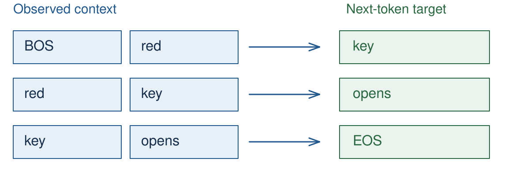
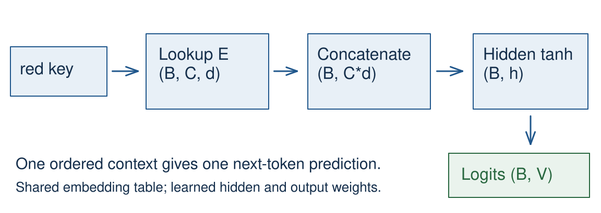
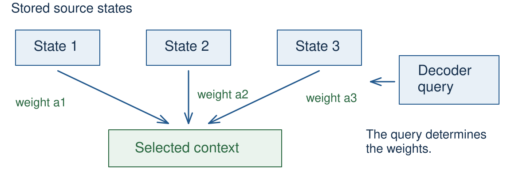
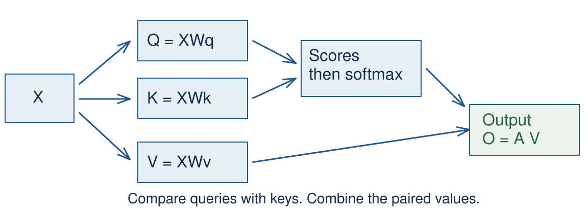
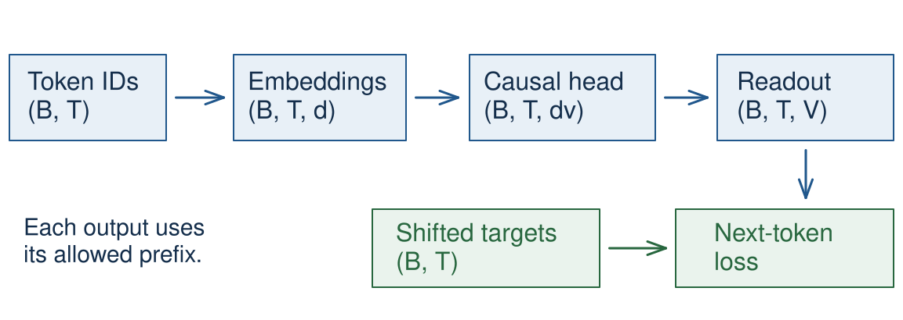

<!-- .slide: class="title-slide" id="title" -->

<p class="eyebrow">CS40008.01</p>

# Neural language models and attention

<p class="subtitle">Lecture 04 – NLP and LLMs</p>

<p class="byline">Baojian Zhou<br>School of Data Science<br>Fudan University<br>September 30, 2026</p>

Note:
Three 45-minute periods. The notebook's E01–E05 are ungraded classroom practices. All examples run offline on CPU. The first period extends last week's model, the second develops attention, and the third checks causal attention. The shared Notebook link opens a personal working copy.

---

<!-- .slide: id="learning-objectives" -->

## What you will be able to do

**How can a model select useful context?**

- Extend a bigram model with a learned context network.
- Fit a tiny batch and diagnose training problems.
- Compute and implement one causal attention head.
- Check its outputs, gradients, and resource costs.

<p class="source">Predict first, then run the notebook. All classroom data are toy examples.</p>

Note:
Allow 1 minute for the opening two slides. Ask students to keep identifying what predicts what. The central course question also contrasts selecting useful stored context with compressing a sequence into one fixed-size state. Full Transformer architecture comes in Lecture 05.

---

<!-- .slide: id="bigram-recap" -->

## Lecture 03's context limit

$$h_t=E[w_t],\qquad z_t=W_o h_t+b_o$$

$$p(w_{t+1}\mid w_t)=\operatorname{softmax}(z_t)$$

The lookup and output projection learn parameters.

**Only the current token determines the next prediction.**

Note:
Allow 2 minutes with the next slide. Recall the vector-bottleneck bigram TinyLM from Lecture 03. Adding a trainable embedding does not let this computation see earlier words. Here t indexes the current input token and z_t predicts t+1. Source: ../lecture-03/teaching-plan.md, learning objectives and running model.

---

<!-- .slide: id="same-last-token" -->

## Two prefixes, one last token

| Observed prefix | Next token in our toy corpus |
| --- | --- |
| BOS **red** key | opens |
| BOS **blue** key | closes |

A bigram must use the same distribution after **key**.

A two-token context can distinguish the prefixes.

<p class="source">Invented text. The two cases occur equally often.</p>

Note:
Ask which information the model needs. Restrict attention to these two targets: the optimal bigram probabilities are 1/2 and 1/2, giving mean loss log(2) nats. Do not claim that all natural-language continuations are deterministic. This corpus is a deliberately controlled debugging example. The notebook trains on six length-2 context/target pairs across the two complete sentences.

---

<!-- .slide: class="outline-slide" id="outline-feedforward" -->

## Outline

<ul class="outline-topics">
<li aria-current="step">Feedforward language models</li>
<li>Selecting context with attention</li>
<li>Causal attention and verification</li>
</ul>

<p class="caption">Period 1 · 45 minutes, including E01 and E02</p>

Note:
Allow 1 minute. Keep this same three-topic outline at each period transition. Trace one end-to-end computation before discussing alternative context mechanisms.

---

<!-- .slide: id="toy-vocabulary" -->

## A small vocabulary

| ID | 0 | 1 | 2 | 3 | 4 | 5 | 6 |
| --- | --- | --- | --- | --- | --- | --- | --- |
| Token | BOS | red | blue | key | opens | closes | EOS |

- IDs are arbitrary lookup indices.
- BOS marks the start; EOS marks the end.
- Each context predicts one following token.

Note:
Allow 2 minutes with the next slide. These IDs are local to this lecture, not the Lecture 02 or 03 mappings. Our seven-row output layer includes BOS, although BOS is never a target. There is no padding. We start each length-2 window only once two observed input tokens exist. No example crosses a sentence boundary or predicts after EOS.

---

<!-- .slide: id="context-windows" -->

## Context windows and targets



<p class="caption">Context size C = 2. Advance the window by one token.</p>

Note:
Point to the target outside each context. The blue sentence supplies three more examples in the notebook. Splitting a corpus into train/dev documents must happen before extracting overlapping windows. This particular demonstration uses only a tiny training batch. It has no held-out evaluation.

---

<!-- .slide: id="feedforward-path" -->

## The feedforward language model



<p class="caption">Every position in the fixed window has a place in the concatenated vector.</p>

Note:
Allow 3 minutes with the next slide. Retain the NPLM mechanism from the Spring Lecture 04 slides, pages 17–20, and notebook section 3. The new CPU example uses nn.Module and a local vocabulary, with no Transformers wrapper or downloads. This simplified Bengio-style network omits the optional direct input-to-output connection. Source: Bengio et al. (2003), §2, https://www.jmlr.org/papers/v3/bengio03a.html.

---

<!-- .slide: id="hidden-nonlinearity" -->

## A hidden representation of the context

$$x=[E[w_{t-1}];E[w_t]]$$

$$h=\tanh(W_hx+b_h),\qquad z=W_oh+b_o$$

The nonlinearity lets the network learn interactions.

Consecutive affine layers alone collapse to one affine map.

Note:
Use column-vector notation here. In PyTorch the batch stores row vectors and nn.Linear stores weights as (out_features, in_features). The semicolon in x means concatenation, not summation. This carries forward the Spring slides' nonlinearity and hidden-representation explanation, pages 4–14, without repeating the full XOR derivation. A deeper stack is possible but unnecessary for our debugging example.

---

<!-- .slide: id="shape-ledger" -->

## Shapes through the model

| Quantity | Shape |
| --- | --- |
| Context IDs | $(B,C)$ |
| Embedding lookup | $(B,C,d)$ |
| Concatenated context | $(B,Cd)$ |
| Hidden representation | $(B,h)$ |
| Vocabulary logits | $(B,\lvert V\rvert)$ |

Note:
Allow 2 minutes. B is the number of context windows, not necessarily the number of original documents. There is one target per row. Preserve the within-window position order during flattening. This shape-first reasoning follows CS336 Lecture 2's tensor/einops examples: https://github.com/stanford-cs336/lectures/blob/main/lecture_02.py, tensor_einops().

---

<!-- .slide: class="exercise" id="exercise-01" -->

<p class="exercise-meta">Exercise E01 · 4 minutes · predict, then check</p>

## Contexts and tensor shapes

For **BOS red key opens EOS**, list the three windows and targets.

With $B=2$, $C=2$, $d=4$, $h=8$, and $|V|=7$, give the lookup, concatenated, hidden, and logit shapes.

<div class="answer fragment">
<p>BOS red → key; red key → opens; key opens → EOS.</p>
<p>Shapes: (2, 2, 4), (2, 8), (2, 8), (2, 7).</p>
</div>

Note:
Ask students to write their answers before revealing them. In the notebook E01 uses the first two of six windows, matching B=2. Common mistake: keeping a sequence-length axis in the output even though this model produces one next-token prediction for each complete window. The answer is checked by the notebook's e01_shapes computation.

---

<!-- .slide: id="feedforward-code" -->

## The same path in PyTorch

```python
self.embedding = nn.Embedding(V, d)
self.hidden = nn.Linear(C * d, h)
self.output = nn.Linear(h, V)

def forward(self, ids):
    x = self.embedding(ids)       # B, C, d
    x = x.flatten(start_dim=1)    # B, C*d
    h = torch.tanh(self.hidden(x))
    return self.output(h)        # B, V
```

Note:
Allow 2 minutes. These are excerpts from ContextLM in the notebook; initialization belongs in __init__. The named widths V, d, h, and C correspond to the previous slide. nn.Linear includes a bias by default. Do not apply softmax before passing these logits to cross_entropy. The embedding parameters and hidden/output weights train together.

---

<!-- .slide: id="next-token-loss" -->

## One target per context

$$\ell(z,y)=-z_y+\log\sum_j e^{z_j}$$

```python
logits = model(contexts)           # B, V
loss = F.cross_entropy(logits, y)  # y: B
```

Uniform logits give mean loss $\log |V|$.

For this vocabulary, $\log 7\approx1.9459$ nats.

Note:
Allow 2 minutes. This is a quick retrieval check from Lecture 03 applied to a different context model. The default reduction is the mean over the B examples. The seven-way uniform baseline includes the BOS row. The randomly initialized model need not start exactly at the uniform baseline. Target IDs use the same vocabulary mapping as the output rows.

---

<!-- .slide: id="stable-cross-entropy" -->

## Numerical stability of the loss

For logits $(1000,1001,999)$ and target index $1$:

```python
log_z = torch.logsumexp(logits, dim=-1)
loss = log_z - logits[..., 1]
```

Direct exponentiation overflows. The stable loss is **0.4076 nats**.

<p class="caption">Use raw logits with cross_entropy in the training loop.</p>

Note:
Allow 2 minutes. The notebook computes both versions in float64 and deliberately displays infinity for the naive normalizer. For a general batch, gather each row's target logit rather than always choosing column 1. Subtracting the largest logit changes neither softmax probabilities nor the final log-normalized loss. CS336 Assignment 1 asks students to implement softmax and cross-entropy: https://github.com/stanford-cs336/assignment1-basics/blob/main/tests/adapters.py, run_softmax and run_cross_entropy.

---

<!-- .slide: id="training-step" -->

## One training step

```python
optimizer.zero_grad(set_to_none=True)
logits = model(contexts)
loss = F.cross_entropy(logits, targets)
loss.backward()
optimizer.step()
history.append(loss.item())
```

Gradients accumulate until cleared. The optimizer updates parameters.

Note:
Allow 2 minutes. Ask which line creates gradients and which changes weights. The diagram and model remain the same throughout all 200 updates. history here records the loss before each update. The plotted notebook history instead explicitly measures before training and after every update, so its x-axis reports completed updates correctly. CS336 Lecture 2, train_loop() and gradients_basics(): https://github.com/stanford-cs336/lectures/blob/main/lecture_02.py.

---

<!-- .slide: class="exercise" id="exercise-02" -->

<p class="exercise-meta">Exercise E02 · 6 minutes · explain, repair, run</p>

## A disconnected training loss

```python
loss = F.cross_entropy(model(contexts), y).detach()
loss.backward()
```

Why does this fail? Repair the loop, then fit the six windows.

<div class="answer fragment">
<p>Remove detach. Clear gradients before backward, then call step.</p>
<p>Goal: loss below 0.03 nats after 200 updates.</p>
</div>

Note:
Use the E02 cells. detach removes the connection to trainable parameters; backward raises an error for this scalar. The notebook catches that expected failure before running the corrected loop. Recording loss.item() is safe after obtaining the connected loss. Use CPU, seed 7, SGD learning rate 0.5, C=2, d=4, h=8, and V=7. All six context/target pairs are compatible, making a near-zero fit possible.

---

<!-- .slide: id="tiny-training-curve" -->

## Fitting the tiny batch

<div class="plot" data-plotly="assets/tiny-lm-loss.json" role="img" aria-label="Mean toy training loss falls from about 2.1729 nats to 0.0070 after 200 SGD updates. The dashed uniform-logit baseline is log 7, about 1.9459."></div>

<p class="caption">Six windows · CPU · SGD · a debugging experiment</p>

Note:
Allow 2 minutes with the next slide. This curve is computed from the notebook, not drawn as an idealized trend. Step 0 is before training; step 200 is after 200 updates. Final loss is about 0.006996 on the reference CPU environment. Small floating-point differences are expected across platforms. Low training loss alone provides no evidence about new documents.

---

<!-- .slide: id="context-predictions" -->

## The learned distinction

| Context | Target | Model prediction |
| --- | --- | --- |
| red key | opens | opens |
| blue key | closes | closes |

The model now uses the earlier token.

**All six training windows are predicted correctly.**

Note:
Read the notebook output for all six cases: key, opens, EOS, key, closes, EOS. Ask students why this is impossible for the one-token baseline on the two key contexts. It is possible here because the concatenated vectors distinguish red key from blue key. These are training-set predictions, not held-out accuracy.

---

<!-- .slide: id="training-diagnosis" -->

## When the tiny batch will not fit

| Observation | First check |
| --- | --- |
| Backward fails | Detached loss or disabled gradients |
| Loss stays flat | Updates, learning rate, target alignment |
| Loss becomes non-finite | Logits, gradients, learning rate |
| Same input, conflicting targets | The model's visible context |

Note:
Allow 2 minutes. These are starting checks, not unique diagnoses. Print a few context/target pairs, inspect gradient norms, and verify that a parameter changes after step. Nonzero gradients alone do not prove a correct implementation. Conflicting targets can have irreducible conditional entropy even with perfect optimization. The current length-2 batch intentionally avoids such conflicts.

---

<!-- .slide: id="fitting-and-generalization" -->

## Training fit and generalization

| Question | Evidence |
| --- | --- |
| Can this implementation learn? | Fit a small, consistent training batch |
| Does it predict new text? | Loss on separately held-out documents |

Split documents **before** making overlapping windows.

Keep tokenizer, target alignment, and loss units consistent.

Note:
Use the final minutes of period 1 for discussion and notebook catch-up. Our six-window experiment has no held-out evaluation. eval() changes modules such as dropout; no_grad() controls gradient recording. Neither changes which data are evaluated. Held-out perplexity exp(mean NLL) is comparable only under the same tokenization and scoring conventions, as discussed in Lecture 02. Resume with the next outline after the break.

---

<!-- .slide: class="outline-slide" id="outline-attention" -->

## Outline

<ul class="outline-topics">
<li>Feedforward language models</li>
<li aria-current="step">Selecting context with attention</li>
<li>Causal attention and verification</li>
</ul>

<p class="caption">Period 2 · 45 minutes, including E03</p>

Note:
The opening recurrence bridge takes about 8 minutes. Focus on the reason to change context mechanisms. Detailed LSTM gate derivations and training remain in optional reading.

---

<!-- .slide: id="context-mechanisms" -->

## Ways to represent context

| Mechanism | What reaches a prediction? |
| --- | --- |
| Fixed-window network | A fixed number of recent token vectors |
| Recurrent network | A state updated through the prefix |
| Attention | A weighted combination of allowed states |

The next-token prediction task stays the same.

Note:
Allow 1 minute. This is a comparison of mechanisms, not a claim that one always wins on every task or budget. Attention can operate on recurrent states as well as token-derived vectors. A full architecture can combine multiple mechanisms. The lecture will implement one simple self-attention head.

---

<!-- .slide: id="recurrent-state" -->

## A recurrent state


<p class="caption">Each update uses the previous state and the current input.</p>

Note:
Allow 2 minutes. h_t = tanh(W_x x_t + W_h h_{t-1} + b). The recurrent transition shares parameters across positions. It can in principle depend on the entire earlier prefix, but information must survive the state updates. The state dimensions stay fixed as the prefix grows. Source: instructor's Spring Lecture 04, pages 38–44, https://github.com/baojian/llm-26/blob/main/slides/lecture-04-slides/lecture-04-slides.pdf#page=38.

---

<!-- .slide: id="recurrent-gradients" -->

## Gradients through repeated updates

The chain rule multiplies local derivatives along the sequence.

$$0.9^{50}\approx0.0052,\qquad 1.1^{50}\approx117.4$$

These scalar examples illustrate shrinking and growing signals.

Real recurrent gradients involve **products of Jacobians**.

Note:
Allow 1 minute. The numbers are illustrative, not measured RNN gradients. The path also depends on activation derivatives and weight matrices. Do not promise that every recurrent gradient vanishes or explodes. This compresses the Spring discussion on pages 60–62 into one motivation slide. It prepares the purpose of gates without a full BPTT derivation.

---

<!-- .slide: id="lstm-purpose" -->

## LSTM memory and gates

$$c_t=f_t\odot c_{t-1}+i_t\odot\widetilde c_t$$

- The forget gate controls retained cell information.
- The input gate controls new information.
- The output gate controls exposure of the cell state.

Gates help preserve information across repeated updates.

Note:
Allow 2 minutes. The displayed equation is the cell-state update; h_t additionally uses an output gate and tanh(c_t). Values of the forget gate near one can help maintain a direct memory path. Gates do not guarantee perfect long-range memory or eliminate sequential dependence. Further derivations and the original training notebook are linked in optional-reading.md. Source: Spring Lecture 04, pages 63–73.

---

<!-- .slide: id="encoder-bottleneck" -->

## Selecting from stored context



<p class="caption">Historical motivation: a decoder can revisit different source states.</p>

Note:
Allow 2 minutes. The fixed-vector bottleneck here refers specifically to early encoder–decoder designs. Bahdanau, Cho, and Bengio introduce query-dependent additive attention over encoder states. This is cross-attention in a translation setting. Our next example uses scaled dot products, and our implementation uses self-attention. Keep those distinctions explicit. Source: https://arxiv.org/abs/1409.0473, §§2–3. The diagram is an original schematic, not their architecture figure.

---

<!-- .slide: id="weighted-context" -->

## A weighted combination of values

$$o_i=\sum_j a_{ij}v_j$$

$$a_{ij}\geq0,\qquad\sum_j a_{ij}=1$$

Each query gets its own weights.

The output combines the corresponding **value vectors**.

Note:
Allow 3 minutes. Begin with the familiar operation of a weighted average. Which item gets weight is separate from what vector is contributed. The coefficients are scalar weights; the values and output are vectors. In this head there is no dropout, so the weights sum to one over the allowed keys. Next establish how the model computes those coefficients.

---

<!-- .slide: id="qkv-roles" -->

## Queries, keys, and values



<p class="caption">Self-attention derives Q, K, and V from the same input sequence.</p>

Note:
Allow 3 minutes. Q = XW_Q, K = XW_K, V = XW_V in row-vector notation. The three projections have separate learned parameters. All input positions produce a query as well as a key and a value. A key and a value at the same position remain paired. Source: Vaswani et al. (2017), §§3.2.1–3.2.3, https://arxiv.org/abs/1706.03762. Cross-attention obtains queries from a different sequence than the keys and values.

---

<!-- .slide: id="attention-shapes" -->

## Shapes inside one head

| Tensor | Shape |
| --- | --- |
| Queries Q, keys K | $(B,T,d_k)$ |
| Values V | $(B,T,d_v)$ |
| Scores and weights | $(B,T,T)$ |
| Output O | $(B,T,d_v)$ |

<p class="caption">Rows index queries. Columns index keys.</p>

Note:
Allow 2 minutes. We use self-attention here, so query and key counts are both T. The notebook function also supports different Tq and Tk. d_k must match between Q and K for their dot product; d_v can differ. The batch axis must remain separate. This extends Lecture 03's shape reasoning to attention and follows CS336 Lecture 2's named-dimension approach.

---

<!-- .slide: id="scaled-scores" -->

## Scaled query–key scores

$$s_{ij}=\frac{q_i^\top k_j}{\sqrt{d_k}}$$

Under independent, zero-mean, unit-variance components:

$$\operatorname{Var}(q_i^\top k_j)=d_k$$

Scaling controls the initial spread of the scores.

Note:
Allow 3 minutes. State the independence and variance assumptions before giving this motivation. They are not guaranteed for learned projections. Large score differences can saturate softmax and make some derivatives very small. Dividing by sqrt(d_k) is the standard scaled dot-product definition, not a way to force every learned score variance to one. Source: Vaswani et al. (2017), §3.2.1 and footnote 4 in some PDF versions, https://arxiv.org/html/1706.03762v7#S3.SS2.SSS1.

---

<!-- .slide: id="attention-softmax" -->

## Softmax over keys

$$a_{ij}=\frac{\exp(s_{ij}-m_i)}{\sum_r\exp(s_{ir}-m_i)},\quad m_i=\max_r s_{ir}$$

```python
weights = torch.softmax(scores, dim=-1)
```

Each query row sums to one. Subtracting its maximum preserves the probabilities.

Note:
Allow 2 minutes. With scores shaped (B,T,T), the final dimension indexes keys. Normalizing the query dimension would solve a different problem even though the returned shape looks correct. PyTorch's softmax performs a stable computation. The notebook's large-logit example already motivates avoiding a literal exp/sum implementation.

---

<!-- .slide: id="attention-toy-values" -->

## A three-position example

Let $q_2=(\sqrt{2},0)$ and $d_k=2$.

| Position | Label | Key | Value |
| --- | --- | --- | --- |
| 1 | red | (1, 0) | (1, 0) |
| 2 | key | (0, 1) | (0, 2) |
| 3 | opens | (1, 1) | (3, 1) |

<p class="caption">Hand-chosen vectors. All keys are allowed for now.</p>

Note:
Allow 2 minutes. The labels connect to the toy sentence, but the vectors are invented separately from the trained NPLM. They are not embeddings learned by that model, nor do the coordinates have semantic interpretations. Positions in the slides are one-based; the notebook selects Python index 1 for query 2. Have students compute the scaled score for one key before beginning E03.

---

<!-- .slide: class="exercise" id="exercise-03" -->

<p class="exercise-meta">Exercise E03 · 5 minutes · one row by hand</p>

## Scores, weights, and one output

For $q_2=(\sqrt{2},0)$, calculate:

1. The three scaled scores.
2. The softmax weights, using $e\approx2.7183$.
3. The weighted value vector.

<div class="answer fragment">
<p>Scores: (1, 0, 1). Weights: (0.4223, 0.1554, 0.4223).</p>
<p>Output: (1.6893, 0.7330).</p>
</div>

Note:
Keep the table on the preceding slide available or use the matching notebook table. The denominator is 2e+1. Output coordinate 1 is a_21 + 3a_23; coordinate 2 is 2a_22 + a_23. The notebook recomputes the result in float64. Ask why the output has dimension d_v, not the number of keys.

---

<!-- .slide: id="attention-row-result" -->

## How the values contribute

$$o_2=0.4223(1,0)+0.1554(0,2)+0.4223(3,1)$$

$$o_2\approx(1.6893,0.7330)$$

Equal weights can contribute different vectors.

The keys determine compatibility; the values supply content.

Note:
Allow 2 minutes. Keep full precision in code and round only for display. Values 1 and 3 receive the same weight here because their scores match, yet their contributions differ. Reusing the output from the key vectors would change the computation. This distinction is easier to see numerically than through a semantic analogy alone.

---

<!-- .slide: id="attention-matrix" -->

## All queries together

$$S=\frac{QK^\top}{\sqrt{d_k}},\qquad A=\operatorname{softmax}_{\text{keys}}(S)$$

$$O=AV$$

One matrix multiplication computes all query–key comparisons.

Another combines the values for every query.

Note:
Allow 3 minutes. This is the same row calculation repeated for all positions, not a new operation. In a batch, transpose only the last two axes of K. Parallel evaluation across known input positions is useful in training. Autoregressive generation still produces one new token before the next one can be used. Source: Vaswani et al. (2017), §3.2.1, Equation 1.

---

<!-- .slide: id="batched-attention-code" -->

## Batched tensor operations

```python
# Q, K: B, T, dk     V: B, T, dv
scores = Q @ K.transpose(-2, -1) / math.sqrt(dk)
weights = scores.softmax(dim=-1)  # B, T, T
output = weights @ V             # B, T, dv
```

The score contraction can also be written:

```python
torch.einsum('bik,bjk->bij', Q, K) / math.sqrt(dk)
```

Note:
Allow 3 minutes. Read the indices aloud: batch b, query i, key j, feature k. The feature index is summed out. The two notations express the same contraction; students need not adopt another library for this notebook. CS336 Lecture 2 uses einops.einsum with descriptive axis names; this example uses the built-in torch.einsum equivalent. The current code is intentionally unmasked. Add causal constraints in period 3.

---

<!-- .slide: id="attention-weight-meaning" -->

## Reading an attention weight

A large weight means a larger coefficient on that value vector **in this head**.

The output also depends on the value vectors and later computations.

**A heatmap alone does not establish why a model made a prediction.**

Note:
Use the remaining period-2 minutes for discussion and catch-up. This follows directly from O=AV: attention weights do not specify V or the downstream readout. Avoid calling the displayed colors a full explanation of a trained model. Our heatmap uses invented vectors and exposes the exact numerical output, so students can inspect the mechanism. Ask what would happen if every value vector were identical. Resume with causal attention after the break.

---

<!-- .slide: class="outline-slide" id="outline-causal" -->

## Outline

<ul class="outline-topics">
<li>Feedforward language models</li>
<li>Selecting context with attention</li>
<li aria-current="step">Causal attention and verification</li>
</ul>

<p class="caption">Period 3 · 45 minutes, including E04 and E05</p>

Note:
At the end of this period students have one checked attention component. Keep the architecture preview brief. No new graded exercise or quiz is introduced today.

---

<!-- .slide: id="shift-and-leakage" -->

## Inputs and next-token targets

| Position | Input token | Target | Permitted input positions |
| --- | --- | --- | --- |
| 1 | red | key | 1 |
| 2 | key | opens | 1, 2 |
| 3 | opens | EOS | 1, 2, 3 |

At position 2, reading position 3 would expose the answer.

Note:
Allow 2 minutes. This three-position segment reuses the attention example labels. Its output at input position t predicts the next token t+1. The current token is already observed, so the diagonal is allowed. Distinguish teacher-forced training, where the tensor contains later tokens, from generation, where they have not been generated yet. Source: Vaswani et al. (2017), §3.1 decoder description and §3.2.3.

---

<!-- .slide: id="causal-mask" -->

## A causal score mask

$$M=\begin{bmatrix}0&-\infty&-\infty\\\\0&0&-\infty\\\\0&0&0\end{bmatrix}$$

$$A=\operatorname{softmax}_{\text{keys}}(S+M)$$

Future keys receive zero probability.

<p class="caption">Notebook convention: True means an allowed connection.</p>

Note:
Allow 2 minutes. Rows are queries and columns are keys. The upper triangle is forbidden, excluding the diagonal. In our boolean API, allowed[i,j] means j <= i. Other library APIs may use a different boolean convention, so inspect the contract. At least one finite score remains in every row of this ordinary causal mask.

---

<!-- .slide: id="mask-before-softmax" -->

## Mask before normalization

Query 2 has scores $(1,0,1)$.

| Computation | Resulting weights |
| --- | --- |
| Softmax, then zero future weight | (0.4223, 0.1554, 0) |
| Mask scores, then softmax | (0.7311, 0.2689, 0) |

The first row sums to **0.5777**. The second sums to **1**.

Note:
Allow 2 minutes. Zeroing after softmax without renormalization loses probability mass. Renormalizing the surviving weights would recover the intended distribution in exact arithmetic, but masking scores first expresses the operation directly and avoids an unnecessary unstable route. The notebook computes both rows and their sums.

---

<!-- .slide: class="exercise" id="exercise-04" -->

<p class="exercise-meta">Exercise E04 · 4 minutes · draw and predict</p>

## Which outputs can change?

Draw the allowed connections for three positions.

Change only value 3 from $(3,1)$ to $(13,11)$.

Does query 2's output change with a causal mask? Without one?

<div class="answer fragment">
<p>Masked: unchanged. Unmasked: both coordinates rise by 4.2232.</p>
</div>

Note:
The mask rows are (1,0,0), (1,1,0), and (1,1,1). For unmasked query 2, value 3 carries weight 0.4223188, so adding (10,10) changes the output by about (4.2232,4.2232). This exercise changes only V3 to isolate the weighted-sum mechanism. Later, a stronger test perturbs future input vectors before all learned projections.

---

<!-- .slide: id="attention-demo" -->

## Causal attention in numbers

<div class="plot" id="attention-visual" data-plotly="assets/attention-demo.json" role="img" aria-live="polite" aria-label="Causal attention weights for three queries. Query 2 weights are 0.7311, 0.2689, and zero; its output is 0.7311, 0.5379."></div>

<form class="demo-form" id="attention-controls" aria-label="Attention controls">
<button type="button" data-query="0" aria-label="Select query 1">Q1</button>
<button type="button" data-query="1" aria-label="Select query 2">Q2</button>
<button type="button" data-query="2" aria-label="Select query 3">Q3</button>
<button type="button" id="attention-mask">Mask: on</button>
<button type="button" id="attention-value">Change V3</button>
<button type="button" id="attention-reset">Reset</button>
</form>

Note:
Allow 4 minutes. Initial state: query 2, causal mask on, original values. Ask students to predict, then Change V3: query 2's output stays fixed. Turn Mask off: the third key now contributes, so the output changes. Select Q3 to show that position 3 is allowed to read its own value. Reset restores the entire initial example. Q/K/V are the invented notebook values, not learned model weights. The chart labels distinguish weights from value-space output coordinates. The initial state appears in the PDF.

---

<!-- .slide: id="single-head-code" -->

## One learned self-attention head

```python
q, k, v = self.query(x), self.key(x), self.value(x)
scores = q @ k.transpose(-2, -1) / math.sqrt(dk)
allowed = torch.ones(T, T, dtype=torch.bool).tril()
scores = scores.masked_fill(~allowed, float('-inf'))
weights = scores.softmax(dim=-1)
output = weights @ v
```

Input: $(B,T,d_{model})$. Output: $(B,T,d_v)$.

Note:
Allow 2 minutes. This CPU excerpt combines the core of SingleHead and scaled_attention in the notebook. The full notebook creates the mask on x.device and validates shapes and mask rows. query, key, and value are learned linear projections without biases in this example. There is one head and no dropout. Do not call this a complete Transformer block.

---

<!-- .slide: id="reference-implementation" -->

## A transparent reference

For each batch item and query:

1. List its allowed keys.
2. Compute one dot product for each key.
3. Normalize those scores.
4. Sum the weighted values.

Compare this explicit loop with the batched implementation.

Note:
Allow 2 minutes. The notebook reference does not form a full masked score matrix. It iterates over permitted keys and stacks differentiable scalar dot products. This alternate expression can expose transposition, broadcast, and softmax-axis mistakes. It is deliberately small and slow. The same mathematical contract should produce the same output within numerical tolerances.

---

<!-- .slide: id="forward-check" -->

## Comparing forward outputs

```python
actual, weights = scaled_attention(q, k, v, allowed)
expected = attention_reference(q, k, v, allowed)
torch.testing.assert_close(
    actual, expected, rtol=1e-10, atol=1e-10
)
```

Use small float64 tensors to make numerical differences visible.

Note:
Allow 2 minutes. Absolute and relative tolerances apply to this small float64 computation, not universally to mixed-precision GPU training. Test more than one shape, including unequal query/key counts and different key/value widths. Check normalized rows and masked weights separately. The hand example provides an additional known numerical target rather than relying only on agreement between two programs.

---

<!-- .slide: id="gradient-check" -->

## Gradients need their own check

Choose a scalar probe $L=\sum_{i,r}R_{ir}O_{ir}$.

Compare $\nabla_Q L$, $\nabla_K L$, and $\nabla_V L$.

```python
grads = torch.autograd.grad((output * probe).sum(),
                            (q, k, v))
```

Forward agreement at one input does not establish gradient agreement.

Note:
Allow 2 minutes. Use a nonuniform probe so that a simple accidental symmetry does not cancel the differences. The notebook clones the same inputs into two independent computation graphs and compares each gradient. Finite-difference gradcheck adds another check against numerical perturbations. Gradients flow into the learned projection weights through Q/K/V by the chain rule. CS336 Lecture 2 verifies gradients of matrix products against explicit formulas.

---

<!-- .slide: class="exercise" id="exercise-05" -->

<p class="exercise-meta">Exercise E05 · 6 minutes · implement and verify</p>

## A checked attention head

Write the core score, masked-softmax, and value-product operations.

Run the notebook checks:

- Forward output and Q/K/V gradient agreement.
- Finite-difference gradient check.
- Earlier-output independence from future inputs.

<div class="answer fragment">
<p>All checks pass. A wrong softmax axis or reversed mask must fail.</p>
</div>

Note:
Students predict the three operations before running the supplied explanation. Use E05's explicit reference, gradient comparison, and causal perturbation cells. The notebook is a guided ungraded practice, so it includes runnable explanations. gradcheck uses float64, epsilon 1e-6, atol 1e-5, and rtol 1e-3. Separate the numerical gradient tolerance from the stricter comparison against the loop reference.

---

<!-- .slide: id="causality-regression" -->

## Testing future-input independence

```python
changed = x.detach().clone()
changed[:, 2:] += 10
before, _ = head(x)
after, _ = head(changed)
assert_close(before[:, :2], after[:, :2])
```

A loss using only the first two outputs has **zero gradient** to later inputs.

Note:
Allow 2 minutes. This changes future x values before the learned Q/K/V projections, making it stronger than changing V3 alone. In zero-based Python indexing, [:2] selects positions 1 and 2. The unmasked control changes, demonstrating that the perturbation is meaningful. A loss over all positions can legitimately have gradients at later inputs; do not test that broader loss for zero future gradients.

---

<!-- .slide: id="attention-failure-cases" -->

## Useful failure cases

| Mistake | What exposes it? |
| --- | --- |
| Softmax over queries | Row sums or reference outputs |
| Transposed causal mask | Future-input perturbation |
| Zero weights after softmax | Row sum below one |
| Every key masked | Explicit rejection of the row |

Note:
Allow 2 minutes. A fully masked row sends every score to negative infinity, making ordinary softmax undefined. Our teaching API raises ValueError. That is a deliberate contract; other kernels may define another policy. The API also checks ranks, dimension compatibility, common floating dtype/device, and a boolean mask that broadcasts to the score shape. These checks aid debugging rather than claiming production robustness for arbitrary numerical inputs.

---

<!-- .slide: id="attention-cost" -->

## The cost of longer context

One dense fp32 score matrix, $B=1$:

| Context length T | Score storage |
| --- | --- |
| 512 | 1 MiB |
| 1,024 | 4 MiB |
| 2,048 | 16 MiB |

Doubling T quadruples this matrix's size: **$4BT^2$ bytes**.

Note:
Allow 3 minutes, including an oral prediction before revealing the table. This counts one materialized score tensor only, not total model or training memory. MiB means 2^20 bytes. For d_k=d_v=d, QK^T and AV together use approximately 4BT^2d FLOPs under the two-FLOPs-per-multiply-add convention, excluding projections and softmax. Notebook P01 recomputes the table. Efficient kernels can avoid storing the entire score matrix; keep that systems discussion for later. Method: CS336 Lecture 2, tensors_memory() and tensor_operations_flops().

---

<!-- .slide: id="attention-in-lm" -->

## Attention in the language-model path



<p class="caption">The context computation changes. The next-token objective remains.</p>

Note:
Allow 1 minute. This diagram places the checked component into the familiar token-to-loss path. It is a schematic continuation, not a claim that we trained a Transformer in the notebook. A linear vocabulary readout maps d_v to V logits at each position. Position information and the rest of the Transformer block are the next architecture topic.

---

<!-- .slide: id="position-information" -->

## Where does position enter?

For a fixed query, permuting allowed **key/value pairs together** leaves the weighted sum unchanged.

A dot-product score contains no explicit relative distance.

Causal masks restrict access. Positional representations add position information.

Note:
Allow 1 minute. Use the final query, whose allowed set contains all three pairs, to avoid changing the mask while discussing permutation. Notebook P02 swaps the first two paired keys and values and verifies the same output. This does not imply that an entire causal network is permutation invariant: its masks encode an ordering constraint. Preview position representations without deriving sinusoidal encodings or RoPE. Source: Vaswani et al. (2017), §3.5.

---

<!-- .slide: id="exit-questions" -->

## Exit questions

1. What lets the NPLM distinguish **red key** from **blue key**?
2. Why does query 2 lose access to value 3?
3. Which checks would catch a plausible-looking but incorrect attention implementation?

Note:
Allow 2 minutes. Expected responses: ordered context embeddings and a learned hidden function; next-token alignment makes position 3 a future input; independent forward/gradient comparisons, normalized mask rows, finite differences, and perturbation tests. Ask students to name a failure case for each kind of check. Keep training fit separate from model generalization in their explanations.

---

<!-- .slide: id="continuation" -->

## Continuing the course

**Lecture 05, October 10:** assemble a Transformer from attention, positions, feedforward layers, residual paths, and normalization.

**Optional:** [Spring micrograd and LSTM material](optional-reading.md).

**A1:** due September 30, 23:59, Asia/Shanghai. Submit privately through eLearning.

Note:
The architecture lecture is on Saturday, October 10, replacing the October 7 holiday meeting. Time and room follow the university make-up notice. The A1 reminder follows the published assignment release at https://github.com/baojian/llm-26-fall/issues/140. E01–E05 introduce no new graded submission. Leave the final references slide available for reading.

---

<!-- .slide: class="references" id="references" -->

## Reading

- [Bengio et al. (2003), §2](https://www.jmlr.org/papers/v3/bengio03a.html): the neural probabilistic language model.
- [Bahdanau et al. (ICLR 2015), §§2–3](https://arxiv.org/abs/1409.0473): selecting source context.
- [Vaswani et al. (2017), §§3.2.1 and 3.2.3](https://arxiv.org/abs/1706.03762): attention and masking.
- [CS336 Lecture 2](https://github.com/stanford-cs336/lectures/blob/main/lecture_02.py) and [Assignment 1](https://github.com/stanford-cs336/assignment1-basics): tensor reasoning and implementation checks.

Note:
Selected reading only. Section 3.5 of Vaswani et al. previews positions. The teaching plan and optional reading map the source Spring slides and notebook. All classroom vectors and loss measurements are original toy computations in the companion notebook. No external network access is needed to present the slides or execute the notebook's cells.
